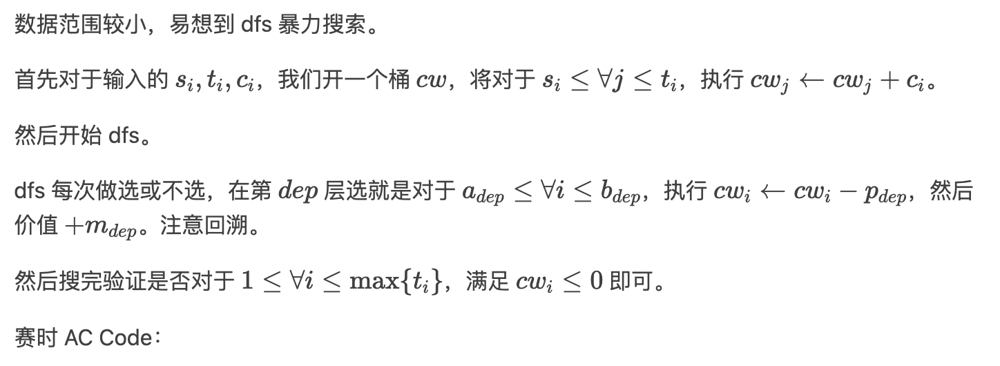
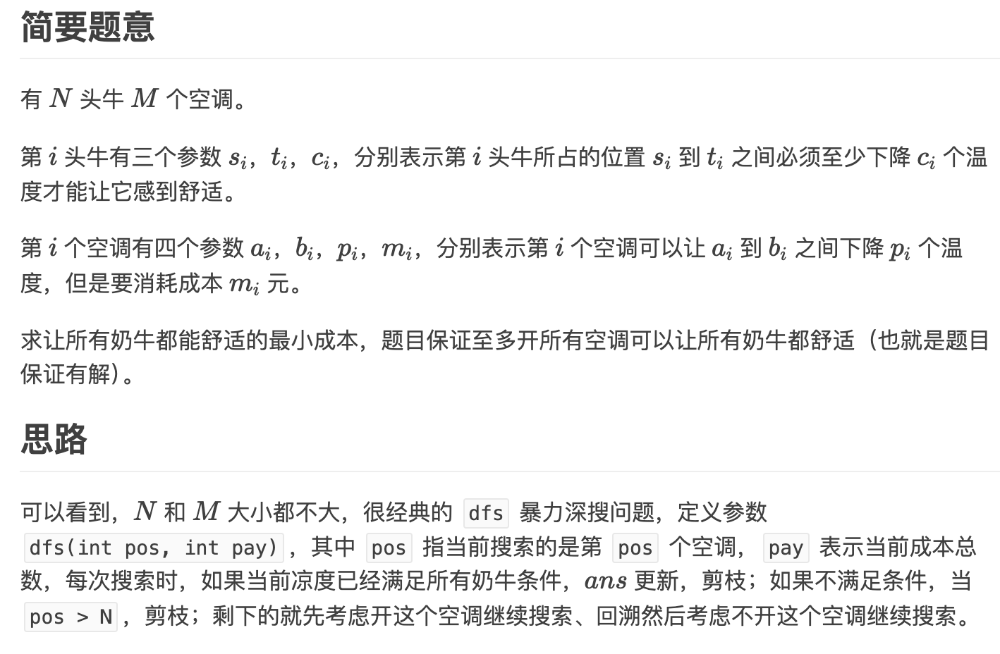

# 1036 [NOIP2002 普及组] 选数

## 题目描述

已知 $n$ 个整数 $x_1,x_2,\cdots,x_n$，以及 $1$ 个整数 $k$（$k<n$）。从 $n$ 个整数中任选 $k$ 个整数相加，可分别得到一系列的和。例如当 $n=4$，$k=3$，$4$ 个整数分别为 $3,7,12,19$ 时，可得全部的组合与它们的和为：

$3+7+12=22$

$3+7+19=29$

$7+12+19=38$

$3+12+19=34$

现在，要求你计算出和为素数共有多少种。

例如上例，只有一种的和为素数：$3+7+19=29$。

## 输入格式

第一行两个空格隔开的整数 $n,k$（$1 \le n \le 20$，$k<n$）。

第二行 $n$ 个整数，分别为 $x_1,x_2,\cdots,x_n$（$1 \le x_i \le 5\times 10^6$）。

## 输出格式

输出一个整数，表示种类数。

## 样例 #1

### 样例输入 #1

```
4 3
3 7 12 19
```

### 样例输出 #1

```
1
```

## 提示

**【题目来源】**

NOIP 2002 普及组第二题

# '''cpp

```cpp
#include <iostream>
#include <cstdio>
using namespace std;
bool isprime(int a){
    for(int i = 2; i * i <= a; i++)
        if(a % i == 0)
            return false;
    return true;
}

int n,k;
int a[25];
long long ans;

void dfs(int m, int sum, int startx){
    if(m == k){
        if(isprime(sum))
            ans++;
        return ;
    }
    for(int i = startx; i < n; i++)
        dfs(m + 1, sum + a[i], i + 1);
    return ;
}

int main(){
    scanf("%d%d",&n,&k);
    for(int i = 0; i < n; i++)
        scanf("%d",&a[i]);
    dfs(0, 0, 0);
    printf("%d\n",ans);
    return 0;
}
```

'''

# P9011[USACO23JAN] Air Cownditioning II B

## 题面翻译

## 题目描述

农夫约翰的 $N$ 头奶牛 $(1≤N≤20)$ 住在一个谷仓里，谷仓里有连续的牛栏，编号为 $1-100$ 。 奶牛 $i$ 占据了编号 $[s_i,t_i]$ 的牛栏。 不同奶牛占据的牛栏范围是互不相交的。 奶牛有不同的冷却要求，奶牛 $i$ 占用的每个牛栏的温度必须至少降低 $c_i$ 单位。

谷仓包含 $M$ 台空调，标记为 $1-M$ $(1\le M\le10)$。第 $i$ 台空调需要花费 $m_i$ 单位的金钱来运行 $(1\le m_i \le 1000)$ ，如果运行，第 $i$ 台空调将牛栏 $[a_i,b_i]$ 所有牛栏的温度降低 $p_i$（$1\le p_i\le10^6）$。 空调覆盖的牛栏范围可能会重叠。

请帮助农夫约翰求出满足所有奶牛需求要花费的最少金钱。

## 输入格式

第一行两个整数，分别为 $N$ 和 $M$。

第 $2$ 至 $(N+1)$ 行，每行三个整数，分别为 $s_i$、$t_i$ 和 $c_i$ 。

第 $(N+2)$ 至 $(M+N+1)$ 行，每行四个整数， 分别为 $a_i$、$b_i$、$p_i$ 和 $m_i$。

## 输出格式

一个整数，表示最少花费的金钱。

## 提示

### 样例解释 1

一种花费最少的可能解决方案是选择那些冷却区间为 $[2,9]$ 、$[1,2]$ 和 $[6,9]$ 的空调，成本为 $ 3+2+5=10$ .

### 数据范围

对于 $100\%$ 的数据，$1 \le N \le 20$， $1 \le M \le 10$, $ 1 \le a_i, b_i, s_i, t_i \le 100$, $1 \le c_i, p_i \le 10^6$， $1 \le m_i \le 1000$。

# '''cpp



```cpp
#include<bits/stdc++.h>
using namespace std;

int n,m,k,ans=1e9,cw[105],s[25],t[25],c[25],a[25],b[25],p[25],v[25];

bool f()//是否满足
{
	for(int i=1;i<=k;i++)
	{
		if(cw[i]>0) return 0;
	}
	return 1;
}

void dfs(int dep,int s)
{
	if(dep>m)
	{
		//cerr<<"DE: ";for(int i=1;i<=k;i++) cerr<<cw[i]<<' ';cerr<<endl;
		if(f()) ans=min(ans,s);//合法就更新答案
		return;
	}
	dfs(dep+1,s);//不选
	for(int i=a[dep];i<=b[dep];i++) cw[i]-=p[dep];
	dfs(dep+1,s+v[dep]);//选
	for(int i=a[dep];i<=b[dep];i++) cw[i]+=p[dep];//回溯
}

int main()
{
	cin>>n>>m;
	for(int i=1;i<=n;i++)
	{
		cin>>s[i]>>t[i]>>c[i];
		k=max(k,t[i]);
		for(int j=s[i];j<=t[i];j++) cw[j]+=c[i];//事先处理
	}
	for(int i=1;i<=m;i++) cin>>a[i]>>b[i]>>p[i]>>v[i];
	dfs(1,0);
	cout<<ans;
	return 0;
}
```

'''

'''cpp

```cpp

#include<bits/stdc++.h>
using namespace std;
int n,m,s[25],t[25],c[25],a[15],b[15],p[15],l[15],ans=0x3f3f3f3f,k[5555];
bool check(){
	for(int i=1;i<=5554;i++){
		if(k[i]>0)
			return false;
	}
	return true;
}
void dfs(int i,int dollar){
	if(i==m+1){
		if(check()){
			ans=min(ans,dollar);
		}
		return;
	}
	dfs(i+1,dollar);
	for(register int j=a[i];j<=b[i];++j){
		k[j]-=p[i];
	}
	dfs(i+1,dollar+l[i]);
	for(register int j=a[i];j<=b[i];++j){
		k[j]+=p[i];
	}
}
int main(){
	cin>>n>>m;
	for(register int i=1;i<=n;++i){
		cin>>s[i]>>t[i]>>c[i];
		for(int j=s[i];j<=t[i];j++)
			k[j]=c[i];
	}
	for(register int i=1;i<=m;++i)
		cin>>a[i]>>b[i]>>p[i]>>l[i];
	dfs(1,0);
	cout<<ans;
	return 0;
}
```

'''

# '''cpp'''



```cpp
#include <bits/stdc++.h>
#define ll long long
#define setp setprecision
#define mem(a, m) memset(a, m, sizeof(a));
using namespace std;

int N, M; 
struct cows{
	int s, t, c;
}cow[25];
int cool[105];//Cool[i]：第i个区间降低的温度 (差分)
struct aircondition{
	int a, b, p, m;
}air[15];
int ans=1145141919;

bool check()
{
	for(int i=1;i<=N;i++)
		for(int j=cow[i].s;j<=cow[i].t;j++)
			if(cool[j] < cow[i].c)
				return false;
	return true;
}
void dfs(int pos, int pay)//第p个空调，当前成本总数
{
	/*cout << "第" << pos-1 << "个空调：";
	for(int i=1;i<=10;i++)	cout << cool[i] << " ";
	cout << endl;*/
	if(check())//所有区间都满足条件 
	{
		//cout << pos << endl;
		ans=min(ans, pay);
		return ;
	}
	else if(pos > M)	return ;//没有达到目标，剪枝 
	else//可以继续搜 
	{
		//开这个空调 
		int d[105];
		mem(d, 0);
		d[air[pos].a]+=air[pos].p;
		d[air[pos].b+1]-=air[pos].p;
		for(int i=1;i<=100;i++)	d[i]+=d[i-1];
		for(int i=1;i<=100;i++)	cool[i]+=d[i];
		dfs(pos+1, pay+air[pos].m);
		//不开，回溯
		for(int i=1;i<=100;i++)	cool[i]-=d[i];
		dfs(pos+1, pay);
	}
}
int main()
{
	ios::sync_with_stdio(false);
	mem(cool, 0);
	cin >> N >> M;
	for(int i=1;i<=N;i++)	cin >> cow[i].s >> cow[i].t >> cow[i].c;
	for(int i=1;i<=M;i++)	cin >> air[i].a >> air[i].b >> air[i].p >> air[i].m;
	dfs(1, 0);
	cout << ans;
	return 0;
}
```
